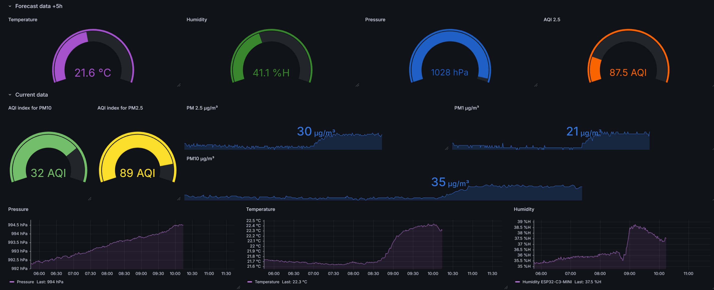

<h1>AirForecast open source project</h1>

AirForecast was designed to collect and visualize air quality data, as well as predict future values using the [Holt-Winters](https://www.pmorgan.com.au/tutorials/holt-winters-method-and-northam-temperature-data/) model. It utilizes InfluxDB as a database for storing data and Grafana for visualizing the values. Additionally, it has two RGB LEDs to visualize the AQI without looking at your screen, so you can easily tell when your air quality is good or bad. This project was inspired by the increasing frequency of wildfires worldwide. AirForecast helps users stay informed about air quality and potential health risks.

## Project Features
- 2 RGB LEDs – Instant AQI (PM2.5) visualization.
- Grafana – Interactive data visualization.
- InfluxDB – Stores data for up to 30 days.
- Holt-Winters Model – Predicts future air quality.
- Environmental Sensors – Measures PM1.0, PM2.5, PM10, temperature, humidity, and pressure.
## Grafana end result

## 🚀 Quick Start  

### **1️⃣ Required Components**  
- **ESP32** development board  
- **PMS7003** (PM1.0, PM2.5, PM10 sensor)  
- **BME280** (temperature, humidity, pressure)  
- **2 RGB LEDs** (NeoPixel)  

### **2️⃣ Pinout & Wiring**  

| Component  | ESP32 Pin |
|------------|-----------|
| PMS7003 RX | **21** |
| PMS7003 TX | **20** |
| BME280 SDA | **6** |
| BME280 SCL | **7** |
| RGB LED    | **4** |

---

